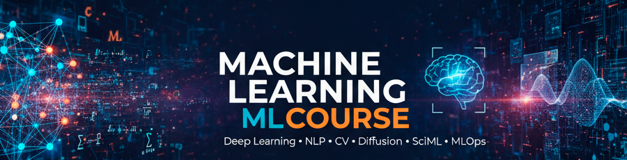

  

# Machine Learning Course

Репозиторий содержит материалы углубленного курса по машинному обучению: от классических алгоритмов до современных подходов в области Generative AI и Scientific ML. Курс включает теоретические лекции, практические семинары, разбор задач с технических собеседований и реализацию исследовательских проектов.

Особое внимание уделяется математическому обоснованию методов, реализации алгоритмов с нуля (from scratch) и работе с актуальными фреймворками.

## Структура репозитория

Материалы разделены на четыре основных блока:
- **[Lectures](Lectures)** — теоретические материалы и демонстрация алгоритмов.
- **[Workshops](Workshops)** — практические занятия по изученным методам.
- **[Projects](Projects)** — реализация сложных прикладных проектов и исследовательские работы.
- **[Tasks](Tasks)** — задачи для подготовки к техническим интервью.

## Программа курса

### Классическое машинное обучение

Базовые алгоритмы, работа с данными и метрики качества.

| Тема | Лекционные материалы | Практические семинары |
| :--- | :--- | :--- |
| **Введение и данные** | [ML Intro](Lectures/classic/week01_01_ml_intro.ipynb), [Data Processing](Lectures/classic/week01_02_data.ipynb) | [Base Libs](Workshops/week01_base_libs.ipynb), [Metrics](Workshops/week01_metrcs.ipynb) |
| **Линейные модели** | [Linear Regression](Lectures/classic/week02_01_lin_reg.ipynb), [Logistic Regression](Lectures/classic/week02_02_log_reg.ipynb) | [Linear Models](Workshops/week02_linear_models.ipynb) |
| **Метрические методы** | [KNN](Lectures/classic/week02_03_knn.ipynb), [Kernels](Lectures/classic/week04_02_kernel_methods.ipynb) | [SVM](Workshops/week04_svm.ipynb) |
| **Ансамбли** | [Ensembles & Boosting](Lectures/classic/week03_01_ensembles.ipynb) | [Boosting Implementation](Workshops/week03_boosting.ipynb) |
| **Аппроксимация** | [Approximation](Lectures/classic/week04_01_approx.ipynb) | [PCA & Dim. Reduction](Workshops/week04_pca.ipynb) |

### Нейронные сети и глубокое обучение

Основы Deep Learning (DL), архитектуры сетей и оптимизационных алгоритмов.

| Тема | Лекционные материалы | Практические семинары |
| :--- | :--- | :--- |
| **Intro to DL** | [Neural Networks](Lectures/classic/week05_nn.ipynb) | [NN from scratch](Workshops/week05_nn.ipynb), [Gradients](Workshops/week06_grads.ipynb) |
| **HuggingFace** | — | [HF Ecosystem](Workshops/week11_hf.ipynb) |

<!-- ### Компьютерное зрение

Обработка изображений, классификация, детекция и современные архитектуры.

| Раздел | Материалы (Лекции и Семинары) |
| :--- | :--- |
| **Обработка изображений** | [Histogram & Contrast](Lectures/cv/cv_course_01_hist_contrast_IQA.ipynb), [Filters](Lectures/cv/cv_course_03_filter.ipynb) |
| **Архитектуры CNN** | [CNN Architectures](Lectures/cv/week07_cv.ipynb), [Detection & Descriptors](Lectures/cv/cv_course_06_detect_descr.ipynb) |
| **Transformers in CV** | [Vision Transformers (ViT)](Lectures/cv/week08_vit.ipynb) | -->

### Natural Language Processing

Обработка естественного языка и большие языковые модели.

- [NLP Basics](Lectures/nlp/week09_nlp.ipynb) — введение в NLP и RNN.
- [GPT Development](Lectures/nlp/gpt_dev.ipynb) — создание GPT-подобной модели.
- [LLM & Agents](Lectures/nlp/week10_llm.ipynb) — большие языковые модели, RAG и агенты.

### Generative Models & Diffusion

Современные генеративные подходы.

- [Diffusion from Scratch](Lectures/diffusion/02_diffusion_models_from_scratch.ipynb) — реализация диффузионной модели.
- [Stable Diffusion](Lectures/diffusion/01_stable_diffusion_introduction.ipynb) — работа с латентной диффузией.
- [DDIM Inversion](Lectures/diffusion/01_ddim_inversion.ipynb) — инверсия и управление генерацией.

### Специализированные темы

- **Reinforcement Learning:** [Введение в RL](Lectures/rl/week11_rl.ipynb).
- **SciML/PIML:** [Physics-Informed Neural Networks](Lectures/piml/week13_piml.ipynb), [Neural ODE](Workshops/week14_neuralode.ipynb).

## Проекты студентов

В директории [Projects](Projects) представлены реализации сложных архитектур и прикладных задач:

- **LLM & NLP:** [RAG](Projects/RAG), [Agents](Projects/Agents), [DistilBERT](Projects/DistilBERT), [Reasoning](Projects/Reasoning), [StateSpaceModels](Projects/StateSpaceModels).
- **Computer Vision:** [YOLOv12](Projects/YOLOv12), [Swin Transformer](Projects/Swin), [ESRGAN](Projects/ESRGAN), [CLIP](Projects/CLIP).
- **Optimization & AutoML:** [LoRA](Projects/LoRA), [AutoML](Projects/AutoML), [FewShot](Projects/FewShot).
- **SciML:** [FBPINNs](Projects/FBPINNs).

## Результаты обучения

По завершении курса слушатели приобретают компетенции в следующих областях:

- Способность реализовать классические ML-алгоритмы и нейронные сети без использования высокоуровневых библиотек.
- Навыки проектирования, обучения и оптимизации архитектур.
- Опыт развертывания моделей (MLOps), работа с Docker и создание API.
- Умение анализировать научные публикации и воспроизводить результаты статей.
- Уверенное владение PyTorch, HuggingFace, Diffusers.

## Автор

**Александр Диков**
*ML Engineer | AI Researcher*

[LinkedIn](https://www.linkedin.com/in/aedikov/) | [Telegram](https://t.me/alexandrdikov)

> Если материалы оказались полезны, поставьте ⭐ этому репозиторию.
> Для вопросов и предложений используйте раздел Issues.